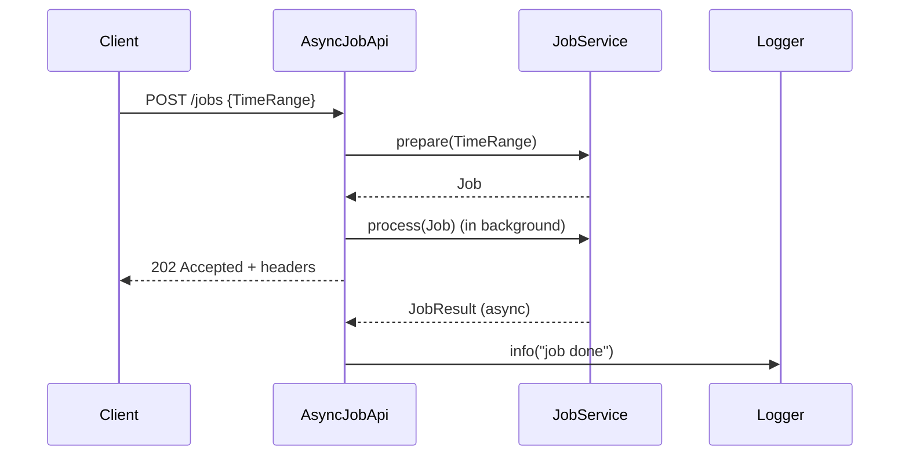

# scala-trial
This repository contains different Scala related small projects: experiments, trial projects, code samples. 

# AsyncJobApi: TDD Journey and Asynchronous REST Design

This article documents the iterative, test-driven development (TDD) process for building the `AsyncJobApi` and its test suite, as well as the design of the asynchronous REST API. It includes a mermaid sequence diagram, code snippets, and commit-driven commentary.

---

## Async REST Call: Sequence Diagram



---

## Table of Contents
- [Async REST Call: Sequence Diagram](#async-rest-call-sequence-diagram)
- [Background](#background)
- [TDD Iterations: Commit-by-Commit](#tdd-iterations-commit-by-commit)
- [Key Code Snippets](#key-code-snippets)
- [Summary](#summary)

---

## Background

The goal: implement an HTTP API for asynchronous job processing using Scala 3, Cats Effect, http4s, and Circe, with robust effectful testing using ScalaTest and Mockito.

---

## TDD Iterations: Commit-by-Commit

### 1. **Project Setup and Library Addition**

Added dependencies for effectful programming, HTTP, JSON, and testing in `build.sbt`.

```scala
libraryDependencies ++= Seq(
  "org.typelevel"      %% "cats-effect"                   % "3.5.2",
  "org.http4s"         %% "http4s-core"                   % "0.23.25",
  "org.http4s"         %% "http4s-dsl"                    % "0.23.25",
  "org.http4s"         %% "http4s-ember-server"           % "0.23.25",
  "org.http4s"         %% "http4s-ember-client"           % "0.23.25",
  "org.http4s"         %% "http4s-circe"                  % "0.23.26",
  "io.circe"           %% "circe-core"                    % "0.14.7",
  "io.circe"           %% "circe-generic"                 % "0.14.7",
  "io.circe"           %% "circe-parser"                  % "0.14.7",
  "io.circe"           %% "circe-literal"                 % "0.14.7",
  "org.scalatest"      %% "scalatest"                     % "3.2.18"   % Test,
  "org.scalacheck"     %% "scalacheck"                    % "1.17.0"   % Test,
  "org.scalatestplus"  %% "mockito-4-11"                   % "3.2.18.0" % Test,
  "org.typelevel"      %% "cats-effect-testing-scalatest"  % "1.7.0"    % Test,
)
```

---

### 2. **First Red Test: Only Status**

Api should return 202 Accepted response (no headers yet).

- Red test:

```scala
val request = Request[IO](Method.HEAD, uri"/jobs")
val api = new AsyncJobApi // this will not compile since AsyncJobApi is not defined yet

```

- Minimal implementation to make it green:

```scala
class AsyncJobApi {
```
- Red test:

```scala

"POST /jobs returns Accepted" in {
  val request = Request[IO](Method.POST, uri"/jobs")
  val api = new AsyncJobApi
  api.routes.orNotFound.run(request).asserting { response =>
    response.status shouldBe Status.Accepted
  }
}
```

- Make it green:

```scala
val routes: HttpRoutes[IO] = HttpRoutes.of[IO]: 
  case req @ POST -> Root / "jobs" => Accepted()
```

---

### 3. **Add X-Total-Count Header (Trivial Implementation)**

- Red test: add `X-Total-Count header` (here I specify only `asserting` code segment)

```scala
import org.typelevel.ci.*
response.status shouldBe Status.Accepted
response.headers.get(ci"X-Total-Count").map(_.head.value) shouldBe Some("42")
```

- Implementation. Make the test green:

```scala
import org.typelevel.ci.*

...

case req @ POST -> Root / "jobs" =>
  for 
    resp <- Accepted()
  yield 
    resp.headers.put(Header.Raw(ci"X-Total-Count", "42"))
```

---

### 4. **Add Location Header**

- Red test: add `Location` header with job ID

```scala
// Test
import org.typelevel.ci.*

val jobId = UUID.fromString("48bf7b76-00aa-4583-b8d6-d63c1830696f")

...

response.status shouldBe Status.Accepted
response.headers.get(ci"X-Total-Count").map(_.head.value) shouldBe Some("42")
response.headers.get(ci"Location").map(_.head.value)  shouldBe Some(s"/jobs/$jobId")
```

- Make it green:

```scala
import org.typelevel.ci.*

case req @ POST -> Root / "jobs" =>
  for resp <- Accepted()
  yield 
    resp.headers.put(
      Header.Raw(ci"X-Total-Count", "42"),
      Location(uri"/jobs/48bf7b76-00aa-4583-b8d6-d63c1830696f")
    )
```

---

### 5. **Refactor: Remove Duplication by Using Standard Library to Extract Headers**

The `Location` header is form `http4s` is a standard library class:

```scala
object Location {
  ...
  
  implicit val headerInstance: Header[Location, Header.Single] =
    Header.create(
      ci"Location",
      _.uri.toString,
      parse,
    )
}
final case class Location(uri: Uri)
```

This gives us the advantage of type-safe header extraction:

```scala
response.headers.get[Location].map(_.uri) shouldBe (uri"/jobs" / jobId).some
```

To achieve the same for `X-Total-Count`, a custom header class is defined:

```scala
import cats.effect.IO
import org.http4s.{Header, ParseResult, Response}
import org.typelevel.ci.*

final case class `X-Total-Count`(count: Long)

object `X-Total-Count` {
  given Header[`X-Total-Count`, Header.Single] =
    Header.create(
      ci"X-Total-Count",
      _.count.toString,
      s => ParseResult.fromTryCatchNonFatal("Invalid X-Total-Count")(
        `X-Total-Count`(s.toLong)
      )
    )
}

extension (response: Response[IO])
  def putHeader[T: [t] =>> Header[t, ?]](header: T): Response[IO] =
    response.putHeaders(header)
```

Now, we can extract both headers in a type-safe way:

```scala
response.headers.get[Location].map(_.uri) shouldBe (uri"/jobs" / jobId).some
response.headers.get[`X-Total-Count`].map(_.count) shouldBe count.some
```

We can also use the convenient `putHeader` extension methods to add type-safe headers to the response:

```scala
case req @ POST -> Root / "jobs" =>
    for
      resp <- Accepted()
    yield
      resp
        .putHeader(Location(uri"/jobs" / "48bf7b76-00aa-4583-b8d6-d63c1830696f")
        .putHeader(`X-Total-Count`(42L))
```

This approach works seamlessly with both standard and custom header types, making the code concise and type-safe.


### 6. **Using JobService**

We need a service that will count the amount of the job based on the query (from, to) and perform the actual job.
We also need job ID for fetching the job when it is done.

#### 6.1. **Add JobService Mock**
```scala
val jobService = mock[JobService] // this will not compile
```

- Implementation:
```scala
class JobService {}
```

#### 6.2. **Add jobService to AsyncJobApi Constructor**

```scala
val jobService = mock[JobService]
val api        = AsyncJobApi(jobService) // this will not compile, thus the test is red
```

To make the test compile, add a constructor parameter to `AsyncJobApi`:

```scala
class AsyncJobApi(jobService: JobService) {
  // ...existing code...
}
```
---

#### 6.3. **Setup Mock for preparing the job**

To make the description faster, we combine 3 TDD steps into one because they are trivial and only concern the compiler,
also steps of adding fields `from` and `to` to `TimeRange` omited as obvious:

```scala
// this will not compile; Job, TimeRange and prepare do not exist yet
val job = JobService.Job(jobId, count = 42L)  
when(jobService.prepare(any[TimeRange])).thenReturn(IO.pure(job)) 
```

Make it compile by adding the following types:

```scala
case TimeRange(from: Instant, to: Instant)

...

object JobService {
  case class Job(id: UUID, count: Long)
}
```

And then:

```scala
class JobService {
  def prepare(range: TimeRange): IO[Job] = ???
}
```

---

#### 6.4. **Add Verification of `prepare` (test is red)**

```scala
val from  = Instant.parse("2026-01-21T12:11:00Z")
val to    = Instant.parse("2026-01-28T17:05:00Z")
val query = TimeRange(from, to)

....

verify(jobService).prepare(query) // test is red because prepare is not invoked yet
```

#### 6.5. **Invoke `prepare` in the code (test is green)**


```scala
case req @ POST -> Root / "jobs" =>
    for
      from  = Instant.parse("2026-01-21T12:11:00Z")
      to    = Instant.parse("2026-01-28T17:05:00Z")
      query = TimeRange(from, to)
      job  <- jobService.prepare(query)
      resp <- Accepted()
    yield
      resp
        .putHeader(Location(uri"/jobs" / job.id.toString))
        .putHeader(`X-Total-Count`(job.count))
```
---

### 6. **Add TimeRange Query to a request body**

```scala
val jobRequest =
  json"""
  {
    "from": "2026-01-21T12:11:00Z",
    "to":   "2026-01-28T17:05:00Z"
  }
"""

...

val request = Request[IO](Method.POST, uri"/jobs")
  .withEntity(jobRequest)
  .withHeaders(`Content-Type`(MediaType.application.json))

....

api.routes.orNotFound.run(request).asserting { response =>
  response.status shouldBe Status.Accepted
  ...
}
```

- Implementation:
```scala
given Decoder[TimeRange] = deriveDecoder[TimeRange]
given EntityDecoder[IO, TimeRange] = jsonOf[IO, TimeRange]

....

val routes: HttpRoutes[IO] = HttpRoutes.of[IO]:
  case req @ POST -> Root / "jobs" =>
    req.as[TimeRange] >>= { query =>
      for
        job  <- jobService.prepare(query)
        resp <- Accepted()
      yield
        resp
          .putHeader(Location(uri"/jobs" / job.id.toString))
          .putHeader(`X-Total-Count`(job.count))
    }
```

This step introduces the `TimeRange` as a request body, allowing the API to assess the amount of work to be processed for the required period. 


### 7. **Sequentially Prepare and Then Process Job**

#### 7.1. **POST /job syncronously**
- The API is extended to first call `prepare` on the job service, then `process` the returned job, and finally respond.
- The test is updated to verify both `prepare` and `process` are called in sequence.


Red test (all together from the above steps) + verification of `process` calls. Re-refactoring steps were omitted as obvious:
test code was rewritten to for-coprehansion, `checkResponse` and `setup` auxilary function were introduced. 

```scala
  "POST /job" should {
    "process the job and then responds withe HTTP headers (synchronously)" in {
      for
        jobService <- setup()
        api         = AsyncJobApi(jobService)
        response   <- api.routes.orNotFound.run(jobRequest)
        assertion  <- checkResponse(response, jobService)
      yield
        assertion
    }
  }

  private def checkResponse(response: Response[IO], jobService: JobService) = IO {
    ...
    verify(jobService).prepare(is(query))
    verify(jobService).process(is(job))
    ...
  }

  private def setup() = IO {
    val jobService = mock[JobService]
    when(jobService.prepare(any[TimeRange])).thenReturn(IO.pure(job))
    when(jobService.process(any[JobService.Job])).thenReturn(jobResult.get)
    jobService
  }
}


```

Now it is straightforward to make it green: 
```scala
// In AsyncJobApi
val routes: HttpRoutes[IO] = HttpRoutes.of[IO] {
  case req @ POST -> Root / "jobs" =>
    req.as[TimeRange] >>= { query =>
      for 
        job <- jobService.prepare(query)
        _   <- jobService.process(job)
        resp <- Accepted()
      yield 
        resp
          .putHeader(Location(uri"/jobs" / job.id.toString))
          .putHeader(`X-Total-Count`(job.count))
    }
}
```

---

#### 7.2. Refactor: verification functionality idiomatically 

- The `verifyIO` helper was introduced to wrap Mockito verifications in IO, making them effectful and idiomatic.

```scala
private def verifyIO[R, A](r: R)(f: R => A): IO[A] =
  IO(verify(r, timeout(100).times(1))).map(f)

"POST /jobs" should {
  "initiates the job in parallel and responds with HTTP headers immediately" in {
    for {
      ...
      _          <- verifyIO(jobService)(_.prepare(is(query)))
      _          <- verifyIO(jobService)(_.process(is(job)))
    } yield assertion
  }
}

...


```

This refactoring improved test clarity, reduced duplication, and made effectful verification idiomatic.

---

### 8. **Asynchronous Job Processing**


### 9. **Asynchronous Logging on Job Completion**

Added a logger to notify when the job is done, and updated tests to verify this behavior.

```scala
// Test
"log job result asynchronously when job completes" in {
  for {
    jobResult <- Deferred[IO, JobResult]
    deps      <- setup(jobResult)
    api        = AsyncJobApi(deps.jobService, deps.logger)
    response  <- api.routes.orNotFound.run(request).timeout(100.millis)
    assertion <- checkResponse(response)
    _         <- jobResult.complete(JobResult(jobId, processed = 40L))
    _         <- verifyIO(deps.logger):
                  _.info(is(s"[Async] [POST] [/jobs] id: $jobId, items processed: 40"))
  } yield assertion
}
```

```scala
private def postProcess(result: JobService.JobResult) =
  logger.info(s"[Async] [POST] [/jobs] id: ${result.id}, items processed: ${result.processed}")

// Usage in POST /jobs handler
case req @ POST -> Root / "jobs" =>
  req.as[TimeRange].flatMap { query =>
    for {
      job  <- jobService.prepare(query)
      _    <- jobService.process(job).flatMap(postProcess).start
      resp <- Accepted()
    } yield resp
      .putHeader(Location(uri"/jobs" / job.id.toString))
      .putHeader(`X-Total-Count`(job.count))
  }
```

---

### 10. **API and Model Refinement**
> `[AsyncRest] Update JobService to return JobResult instead of Long and adapt AsyncJobApi and tests accordingly`

- Improved the API by returning a richer result type, updating both implementation and tests.

---


## Key Code Snippets

### AsyncJobApi (final form)
```scala
class AsyncJobApi(jobService: JobService, logger: Logger) {
  val routes: HttpRoutes[IO] = HttpRoutes.of[IO]:
    case req @ POST -> Root / "jobs" =>
      req.as[JobRequest] >>= { query =>
        for
          job  <- jobService.prepare(query)
          _    <- jobService.process(job).flatMap(postProcess).start
          resp <- Accepted()
        yield
          resp
            .putHeader(Location(uri"/jobs" / job.id.toString))
            .putHeader(`X-Total-Count`(job.count))
            
  private def postProcess(result: JobService.JobResult) =
    logger.info(s"[Async] [POST] [/jobs] id: ${result.id}, items processed: ${result.processed}")
}
```

### AsyncJobApiSpec (test, final form)
```scala
"POST /jobs" should {
  "initiates the job in parallel and responds with HTTP headers immediately" in {
    for {
      jobResult  <- Deferred[IO, JobService.JobResult]
      deps       <- setup(jobResult)
      api         = AsyncJobApi(deps.jobService, deps.logger)
      response   <- api.routes.orNotFound.run(request).timeout(100.millis)
      assertion  <- checkResponse(response)
      _          <- verifyIO(deps.jobService)(_.prepare(is(query)))
      _          <- verifyIO(deps.jobService)(_.process(is(job)))
    } yield assertion
  }
  "log job result asynchronously when job completes" in {
    for {
      jobResult <- Deferred[IO, JobResult]
      deps      <- setup(jobResult)
      api        = AsyncJobApi(deps.jobService, deps.logger)
      response  <- api.routes.orNotFound.run(request).timeout(100.millis)
      assertion <- checkResponse(response)
      _         <- jobResult.complete(JobResult(jobId, processed = 40L))
      _         <- verifyIO(deps.logger):
                    _.info(is(s"[Async] [POST] [/jobs] id: $jobId, items processed: 40"))
    } yield assertion
  }
}
```

---

## Summary

- The API and its tests evolved through small, test-driven steps.
- Each commit focused on a single change: red test, green code, or refactor.
- The final result is a robust, idiomatic, and well-tested async REST API.
