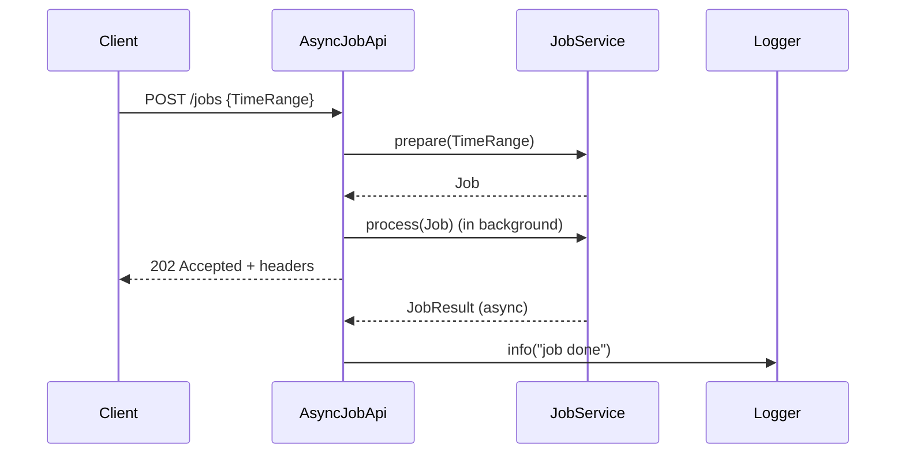

# scala-trial
This repository contains different Scala related small projects: experiments, trial projects, code samples. 

# AsyncJobApi: TDD Journey and Asynchronous REST Design

This article documents the iterative, test-driven development (TDD) process for building the `AsyncJobApi` and its test suite, as well as the design of the asynchronous REST API. It includes a mermaid sequence diagram, code snippets, and commit-driven commentary.

---

## Async REST Call: Sequence Diagram



---

## Table of Contents
- [Async REST Call: Sequence Diagram](#async-rest-call-sequence-diagram)
- [Background](#background)
- [TDD Iterations: Commit-by-Commit](#tdd-iterations-commit-by-commit)
- [Key Code Snippets](#key-code-snippets)
- [Summary](#summary)

---

## Background

The goal: implement an HTTP API for asynchronous job processing using Scala 3, Cats Effect, http4s, and Circe, with robust effectful testing using ScalaTest and Mockito.

---

## TDD Iterations: Commit-by-Commit

### 1. **Project Setup and Library Addition**
> `[AsyncRest] added scalatest, http4s, and cats-effect libs`

- Added dependencies for effectful programming, HTTP, JSON, and testing in `build.sbt`.

```scala
libraryDependencies ++= Seq(
  "org.typelevel"      %% "cats-effect"                   % "3.5.2",
  "org.http4s"         %% "http4s-core"                   % "0.23.25",
  "org.http4s"         %% "http4s-dsl"                    % "0.23.25",
  "org.http4s"         %% "http4s-ember-server"           % "0.23.25",
  "org.http4s"         %% "http4s-ember-client"           % "0.23.25",
  "org.http4s"         %% "http4s-circe"                  % "0.23.26",
  "io.circe"           %% "circe-core"                    % "0.14.7",
  "io.circe"           %% "circe-generic"                 % "0.14.7",
  "io.circe"           %% "circe-parser"                  % "0.14.7",
  "io.circe"           %% "circe-literal"                 % "0.14.7",
  "org.scalatest"      %% "scalatest"                     % "3.2.18"   % Test,
  "org.scalacheck"     %% "scalacheck"                    % "1.17.0"   % Test,
  "org.scalatestplus"  %% "mockito-4-11"                   % "3.2.18.0" % Test,
  "org.typelevel"      %% "cats-effect-testing-scalatest"  % "1.7.0"    % Test,
)
```

---

### 2. **First Red Test: Only Status**
> `[AsyncRest] Added POST /jobs trivial API implementation: made test green`

- Wrote a failing test for the endpoint, expecting only a 202 Accepted response (no headers yet).

```scala
// Test
"POST /jobs returns Accepted" in {
  val request = Request[IO](Method.POST, uri"/jobs")
  val response = httpApp.run(request).unsafeRunSync()
  response.status shouldBe Status.Accepted
}
```

- Minimal implementation to make it green:

```scala
case req @ POST -> Root / "jobs" =>
  Accepted()
```

---

### 3. **Add X-Total-Count Header (Trivial Implementation)**
> `[AsyncRest] Added POST /jobs trivial API implementation: added count header`

- Added a test for the X-Total-Count header.

```scala
// Test
import org.typelevel.ci.*

response.status shouldBe Status.Accepted
response.headers.get(ci"X-Total-Count").map(_.head.value) shouldBe Some("42")
```

- Implementation (using for-comprehension and headers.put):

```scala
case req @ POST -> Root / "jobs" =>
  for resp <- Accepted()
  yield resp.headers.put(
    Header.Raw(CIString("X-Total-Count"), "42")
  )
```

---

### 4. **Add Location Header (Trivial Implementation)**
> `[AsyncRest] Added POST /jobs trivial API implementation: added Location header`

- Add a test for the Location header, similar to X-Total-Count:

```scala
// Test
import org.typelevel.ci.*

val jobId = UUID.fromString("48bf7b76-00aa-4583-b8d6-d63c1830696f")

response.status shouldBe Status.Accepted
response.headers.get(ci"X-Total-Count").map(_.head.value) shouldBe Some("42")
response.headers.get(ci"Location").map(_.head.value)  shouldBe Some(s"/jobs/$jobId")
```

- Implementation (using for-comprehension and resp.headers.put):

```scala
import org.typelevel.ci.*

case req @ POST -> Root / "jobs" =>
  for resp <- Accepted()
  yield 
    resp.headers.put(
      Header.Raw(ci"X-Total-Count", "42"),
      Location(uri"/jobs/48bf7b76-00aa-4583-b8d6-d63c1830696f")
    )
```

---

### 5. **Add TimeRange Query Parameters for Job Counting**
> `[AsyncRest] Add TimeRange parameters to POST /jobs for job counting`

- Test: use a JSON body to provide a time range for job counting.

```scala
val jobRequest =
  json"""
  {
    "from": "2026-01-21T12:11:00Z",
    "to":   "2026-01-28T17:05:00Z"
  }
"""
val request = Request[IO](Method.POST, uri"/jobs")
  .withEntity(jobRequest)
  .withHeaders(`Content-Type`(MediaType.application.json))

response.status shouldBe Status.Accepted
response.headers.get(ci"X-Total-Count").map(_.head.value) shouldBe Some("42")
response.headers.get(ci"Location").map(_.head.value)  shouldBe Some(s"/jobs/$jobId")
```

- This step introduces the TimeRange abstraction, allowing the API to assess the amount of work to be processed for the required period. The actual verification of jobService.count invocation comes in the next step.

---

### 6. **Refactor: Remove Duplication by Using Standard Library to Extract Headers**
> `[AsyncRest] Refactor to use standard http4s/case-insensitive library for header extraction`

- Refactor tests to use standard http4s/case-insensitive library for extracting headers, instead of manual string matching or custom logic.

```scala
import org.typelevel.ci.*

response.headers.get(ci"X-Total-Count").map(_.head.value) shouldBe Some("42")
response.headers.get(ci"Location").map(_.head.value) shouldBe Some(s"/jobs/$jobId")
```

- This makes the tests more idiomatic and robust, leveraging the http4s and Typelevel libraries for header handling.

---

### 7. **Refactor: Remove Duplication by Introducing count Method (TDD Baby Steps)**

#### 7.1. **Add JobService Mock**
> `[AsyncRest] Add jobService mock for API`

```scala
val jobService = mock[JobService]
```

#### 7.2. **Add JobService Class**
> `[AsyncRest] Add JobService class (compilation fails if not present)`

```scala
class JobService {}
```

#### 7.3. **Add jobService to AsyncJobApi Constructor**
> `[AsyncRest] Add jobService to AsyncJobApi constructor`

```scala
val jobService = mock[JobService]
val api = AsyncJobApi(jobService) // this will not compile, thus the test is red
```

- **Implementation:**

To make the test compile, add a constructor parameter to `AsyncJobApi`:

```scala
class AsyncJobApi(jobService: JobService) {
  // ...existing code...
}
```

---

#### 7.4. **Setup Mock for prepare**
> `[AsyncRest] Setup mock for jobService.prepare (test is red)`

```scala
val job = Job(id = JobId.random, count = 42L) // Example job instance for the mock
when(jobService.prepare(any[TimeRange])).thenReturn(IO.pure(job))
```

- **Implementation:**

To make this compile, add the `prepare` method to `JobService`:

```scala
class JobService {
  def prepare(range: TimeRange): IO[Job] = ???
  // ...existing code...
}
```

---

#### 7.5. **Add Verification for count (test is red)**
> `[AsyncRest] Add verification for jobService.count (test is red)`

```scala
verify(jobService).count(is(from), is(to)) // test is red
```

#### 7.6. **Invoke count in the code (test is green)**
> `[AsyncRest] Invoke jobService.count in API (test is green)`

```scala
case req @ POST -> Root / "jobs" =>
  req.as[TimeRange].flatMap { query =>
    jobService.count(query.from, query.to).flatMap { count =>
      Accepted().putHeader(Header.Raw(CIString("X-Total-Count"), count.toString))
    }
  }
```

---

### 8. **Add Location Header and Service Layer**
> `[AsyncRest] Refactor AsyncJobApi: rename count to prepare, add Job model, and update POST /jobs logic and tests`

- Test: check Location header and X-Total-Count.

```scala
response.headers.get(Location) should not be empty
response.headers.get(`X-Total-Count`).map(_.value) shouldBe Some("42")
```

- Implementation: prepare job, process job, return Location and count headers.

```scala
case req @ POST -> Root / "jobs" =>
  req.as[TimeRange].flatMap { query =>
    for {
      job  <- jobService.prepare(query)
      _    <- jobService.process(job).start
      resp <- Accepted()
    } yield resp
      .putHeader(Location(uri"/jobs" / job.id.toString))
      .putHeader(`X-Total-Count`(job.count))
  }
```

---

### 9. **First Red Test and Minimal Implementation**
> `[AsyncRest] POST /jobs returns Accepted and sets headers`

- Wrote a failing test for the POST /jobs endpoint, expecting a 202 Accepted response and headers.

```scala
// Test
"POST /jobs returns Accepted and sets headers" in {
  val request = Request[IO](Method.POST, uri"/jobs")
    .withEntity(json"""{"from": "2026-01-21T12:11:00Z", "to": "2026-01-28T17:05:00Z"}""")
    .withHeaders(`Content-Type`(MediaType.application.json))
  val response = httpApp.run(request).unsafeRunSync()
  response.status shouldBe Status.Accepted
  response.headers.get(Location) should not be empty
  response.headers.get(`X-Total-Count`).map(_.value) shouldBe Some("42")
}
```

- Implemented the minimal code to make it green.

```scala
case req @ POST -> Root / "jobs" =>
  req.as[TimeRange].flatMap { query =>
    Accepted()
      .putHeader(Location(uri"/jobs" / "some-id"))
      .putHeader(Header.Raw(CIString("X-Total-Count"), "42"))
  }
```

---

### 10. **Add Service Layer and Realistic Job Handling**
> `[AsyncRest] POST /jobs prepares and processes job, returns headers`

- Added service logic for job preparation and processing, and updated tests to verify service interactions.

```scala
// Test
"POST /jobs prepares and processes job" in {
  for {
    jobResult <- Deferred[IO, JobResult]
    deps      <- setup(jobResult)
    api        = AsyncJobApi(deps.jobService, deps.logger)
    response  <- api.routes.orNotFound.run(request).timeout(100.millis)
    assertion <- checkResponse(response)
    _         <- verifyIO(deps.jobService)(_.prepare(is(query)))
    _         <- verifyIO(deps.jobService)(_.process(is(job)))
  } yield assertion
}
```

```scala
case req @ POST -> Root / "jobs" =>
  req.as[TimeRange].flatMap { query =>
    for {
      job  <- jobService.prepare(query)
      _    <- jobService.process(job).start
      resp <- Accepted()
    } yield resp
      .putHeader(Location(uri"/jobs" / job.id.toString))
      .putHeader(`X-Total-Count`(job.count))
  }
```

---

### 11. **Asynchronous Logging on Job Completion**
> `[AsyncRest] log job result asynchronously when job completes`

- Added a logger to notify when the job is done, and updated tests to verify this behavior.

```scala
// Test
"log job result asynchronously when job completes" in {
  for {
    jobResult <- Deferred[IO, JobResult]
    deps      <- setup(jobResult)
    api        = AsyncJobApi(deps.jobService, deps.logger)
    response  <- api.routes.orNotFound.run(request).timeout(100.millis)
    assertion <- checkResponse(response)
    _         <- jobResult.complete(JobResult(jobId, processed = 40L))
    _         <- verifyIO(deps.logger):
                  _.info(is(s"[Async] [POST] [/jobs] id: $jobId, items processed: 40"))
  } yield assertion
}
```

```scala
private def postProcess(result: JobService.JobResult) =
  logger.info(s"[Async] [POST] [/jobs] id: ${result.id}, items processed: ${result.processed}")

// Usage in POST /jobs handler
case req @ POST -> Root / "jobs" =>
  req.as[TimeRange].flatMap { query =>
    for {
      job  <- jobService.prepare(query)
      _    <- jobService.process(job).flatMap(postProcess).start
      resp <- Accepted()
    } yield resp
      .putHeader(Location(uri"/jobs" / job.id.toString))
      .putHeader(`X-Total-Count`(job.count))
  }
```

---

### 12. **Test Refactoring and Helper Extraction**
> `[AsyncRest] Replace direct verify calls with verifyIO in AsyncJobApiSpec to simplify verification logic and improve readability`

- Refactored tests to reduce duplication and made verification effectful and idiomatic.

```scala
def verifyIO[R, A](r: R)(f: R => A): IO[A] =
  IO(verify(r, timeout(100).times(1))).map(f)
```

---

### 13. **API and Model Refinement**
> `[AsyncRest] Update JobService to return JobResult instead of Long and adapt AsyncJobApi and tests accordingly`

- Improved the API by returning a richer result type, updating both implementation and tests.

---


## Key Code Snippets

### AsyncJobApi (final form)
```scala
class AsyncJobApi(jobService: JobService, logger: Logger) {
  val routes: HttpRoutes[IO] = HttpRoutes.of[IO]:
    case req @ POST -> Root / "jobs" =>
      req.as[TimeRange] >>= { query =>
        for
          job  <- jobService.prepare(query)
          _    <- jobService.process(job).flatMap(postProcess).start
          resp <- Accepted()
        yield
          resp
            .putHeader(Location(uri"/jobs" / job.id.toString))
            .putHeader(`X-Total-Count`(job.count))
      }
  private def postProcess(result: JobService.JobResult) =
    logger.info(s"[Async] [POST] [/jobs] id: ${result.id}, items processed: ${result.processed}")
}
```

### AsyncJobApiSpec (test, final form)
```scala
"POST /jobs" should {
  "initiates the job in parallel and responds with HTTP headers immediately" in {
    for
      jobResult  <- Deferred[IO, JobResult]
      deps       <- setup(jobResult)
      api         = AsyncJobApi(deps.jobService, deps.logger)
      response   <- api.routes.orNotFound.run(request).timeout(100.millis)
      assertion  <- checkResponse(response)
      _          <- verifyIO(deps.jobService)(_.prepare(is(query)))
      _          <- verifyIO(deps.jobService)(_.process(is(job)))
    yield
      assertion
  }
  "log job result asynchronously when job completes" in {
    for
      jobResult <- Deferred[IO, JobResult]
      deps      <- setup(jobResult)
      api        = AsyncJobApi(deps.jobService, deps.logger)
      response  <- api.routes.orNotFound.run(request).timeout(100.millis)
      assertion <- checkResponse(response)
      _         <- jobResult.complete(JobResult(jobId, processed = 40L))
      _         <- verifyIO(deps.logger):
                    _.info(is(s"[Async] [POST] [/jobs] id: $jobId, items processed: 40"))
    yield
      assertion
  }
}
```

---

## Summary

- The API and its tests evolved through small, test-driven steps.
- Each commit focused on a single change: red test, green code, or refactor.
- The final result is a robust, idiomatic, and well-tested async REST API.
