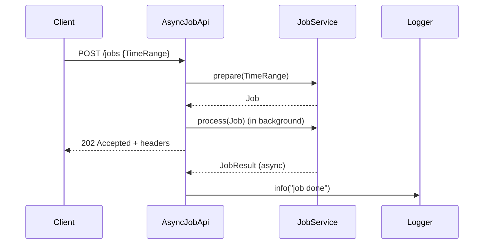

# scala-trial
This repository contains various Scala-related small projects: experiments, trial projects, and code samples.

# AsyncJobApi: TDD Journey and Asynchronous REST Design

This article documents the iterative, test-driven development (TDD) process for building the `AsyncJobApi` and its test suite, as well as the design of the asynchronous REST API. It is split into two major parts: **Synchronous Job Processing** and **Asynchronous (Parallel) Job Processing**. The approach demonstrates how to first implement and test a sequential solution, and then evolve it to a parallel solution by adding new tests and implementation only when needed and possible.

---

## Table of Contents
- [Async REST Call: Sequence Diagram](#async-rest-call-sequence-diagram)
- [The Solution](#the-solution)
  - [AsyncJobApiSpec (test, final form)](#asyncjobapispec-test-final-form)
  - [AsyncJobApi (final form)](#asyncjobapi-final-form)
- [Background](#background)
- [Synchronous Job Processing](#synchronous-job-processing)
- [Asynchronous (Parallel) Job Processing](#asynchronous-parallel-job-processing)
- [Key Code Snippets](#key-code-snippets)
- [Summary](#summary)


## Async REST Call: Sequence Diagram



## The Solution

First things first. Directly to the point. This is how it is done. Below are the details on how we get there.

### AsyncJobApiSpec (test, final form)


```scala
"POST /jobs" should {
  "initiates the job in parallel and responds with HTTP headers immediately" in {
    for {
      jobResult  <- Deferred[IO, JobResult]
      deps       <- setup(jobResult)
      api         = AsyncJobApi(deps.jobService, deps.logger)
      response   <- api.routes.orNotFound.run(request).timeout(100.millis)
      assertion  <- checkResponse(response)
      _          <- verifyIO(deps.jobService)(_.prepare(is(query)))
      _          <- verifyIO(deps.jobService)(_.process(is(job)))
    } yield assertion
  }
  "log job result asynchronously when job completes" in {
    for {
      jobResult <- Deferred[IO, JobResult]
      deps      <- setup(jobResult)
      api        = AsyncJobApi(deps.jobService, deps.logger)
      response  <- api.routes.orNotFound.run(request).timeout(100.millis)
      assertion <- checkResponse(response)
      _         <- jobResult.complete(JobResult(jobId, processed = 40L))
      _         <- verifyIO(deps.logger):
                    _.info(is(s"[Async] [POST] [/jobs] id: $jobId, items processed: 40"))
    } yield assertion
  }

  private def verifyIO[R, A](r: R)(f: R => A): IO[A] =
    IO(verify(r, timeout(100).times(1))).map(f)

  private def checkResponse(response: Response[IO]) = IO {
    response.status shouldBe Status.Accepted
    response.headers.get[Location].map(_.uri) shouldBe (uri"/jobs" / jobId).some
    response.headers.get[`X-Total-Count`].map(_.count) shouldBe count.some
  }
}
```

### AsyncJobApi (final form)
```scala
class AsyncJobApi(jobService: JobService, logger: Logger) {
  val routes: HttpRoutes[IO] = HttpRoutes.of[IO]:
    case req @ POST -> Root / "jobs" =>
      req.as[TimeRange] >>= { query =>
        for
          job  <- jobService.prepare(query)
          _    <- jobService.process(job).flatMap(postProcess).start
          resp <- Accepted()
        yield
          resp
            .putHeader(Location(uri"/jobs" / job.id.toString))
            .putHeader(`X-Total-Count`(job.count))
      }

  private def postProcess(result: JobService.JobResult) =
    logger.info(s"[Async] [POST] [/jobs] id: ${result.id}, items processed: ${result.processed}")
}
```

---

## Background

The goal: implement an HTTP API for asynchronous job processing using Scala 3.8 syntax, Cats Effect, http4s, and Circe, with robust effectful testing using ScalaTest and Mockito.

- **Scala 3.8 Syntax:**
  - Uses the new `:` notation for higher-order functions (HOFs) and control structures where concise, but retains `{}` braces for longer code blocks or where clarity is needed.
- **Deferred as a Crucial Component:**
  - The Cats Effect `Deferred` primitive is essential for this feature. It enables precise control over asynchronous job completion and test synchronization, allowing tests to deterministically verify background processing and notification logic.
- **Assumptions:**
  - The API is designed for demonstration and educational purposes, not for production use.
  - The job processing logic is abstracted and mocked for testing; real-world integrations (e.g., database, external services) are not included.
  - The API is stateless and does not persist job state beyond the scope of the test.
- **Restrictions:**
  - No authentication, authorization, or rate limiting is implemented.
  - Error handling is minimal and focused on the TDD process, not on comprehensive API robustness.
  - The solution assumes a single-node, in-memory execution model (no clustering or distributed job management).

---

## Synchronous Job Processing

The initial implementation and TDD process focus on a sequential (synchronous) solution. This approach is simple, easy to reason about, and provides a solid foundation for correctness before introducing parallelism.

### Idea
- **Start with a sequential solution:**
  - Implement the API so that job preparation and processing happen in sequence, and the response is sent only after the job is fully processed.
  - Write tests that expect the response only after all work is done.
- **Advantages:**
  - Simpler to implement and test.
  - Ensures correctness and clarity before introducing concurrency.

### TDD Steps (Sequential)

### 1. **Project Setup and Library Addition**

Added dependencies for effectful programming, HTTP, JSON, and testing in `build.sbt`.

```scala
libraryDependencies ++= Seq(
  "org.typelevel"      %% "cats-effect"                   % "3.5.2",
  "org.http4s"         %% "http4s-core"                   % "0.23.25",
  "org.http4s"         %% "http4s-dsl"                    % "0.23.25",
  "org.http4s"         %% "http4s-ember-server"           % "0.23.25",
  "org.http4s"         %% "http4s-ember-client"           % "0.23.25",
  "org.http4s"         %% "http4s-circe"                  % "0.23.26",
  "io.circe"           %% "circe-core"                    % "0.14.7",
  "io.circe"           %% "circe-generic"                 % "0.14.7",
  "io.circe"           %% "circe-parser"                  % "0.14.7",
  "io.circe"           %% "circe-literal"                 % "0.14.7",
  "org.scalatest"      %% "scalatest"                     % "3.2.18"   % Test,
  "org.scalacheck"     %% "scalacheck"                    % "1.17.0"   % Test,
  "org.scalatestplus"  %% "mockito-4-11"                  % "3.2.18.0" % Test,
  "org.typelevel"      %% "cats-effect-testing-scalatest" % "1.7.0"    % Test,
)
```

---

### 2. **First Red Test: Only Status**

The API should return a 202 Accepted response.

```scala
val request = Request[IO](Method.POST, uri"/jobs")
val api = new AsyncJobApi // this will not compile since AsyncJobApi is not defined yet
```

- Minimal implementation to make it green:

```scala
class AsyncJobApi {
  // ...implementation...
}
```

- Red test:

```scala
"POST /jobs returns Accepted" in {
  val request = Request[IO](Method.POST, uri"/jobs")
  val api = new AsyncJobApi
  api.routes.orNotFound.run(request).asserting { response =>
    verify(jobService).prepare(query)
  }
}
```

- Make it green:

```scala
val routes: HttpRoutes[IO] = HttpRoutes.of[IO] {
  case req @ POST -> Root / "jobs" => Accepted()
}
```

---

### 3. **Add X-Total-Count Header (Trivial Implementation)**

- Red test: add `X-Total-Count` header (only the assertion is shown)

```scala
import org.typelevel.ci.*
response.status shouldBe Status.Accepted
response.headers.get(ci"X-Total-Count").map(_.head.value) shouldBe Some("42")
```

- Implementation. Make the test green:

```scala
case req @ POST -> Root / "jobs" =>
  for {
    resp <- Accepted()
  } yield resp.headers.put(Header.Raw(ci"X-Total-Count", "42"))
```

---

### 4. **Add Location Header**

- Red test: add `Location` header with job ID

```scala
val jobId = UUID.fromString("48bf7b76-00aa-4583-b8d6-d63c1830696f")
response.status shouldBe Status.Accepted
response.headers.get(ci"X-Total-Count").map(_.head.value) shouldBe Some("42")
response.headers.get(ci"Location").map(_.head.value) shouldBe Some(s"/jobs/$jobId")
```

- Make it green:

```scala
case req @ POST -> Root / "jobs" =>
  for {
    resp <- Accepted()
  } yield resp.headers.put(
    Header.Raw(ci"X-Total-Count", "42"),
    Location(uri"/jobs/48bf7b76-00aa-4583-b8d6-d63c1830696f")
  )
```

---

### 5. **Refactor: Remove Duplication by Using Standard Library to Extract Headers**

The `Location` header from `http4s` is a standard library class:

```scala
object Location {
  // ...
  implicit val headerInstance: Header[Location, Header.Single] =
    Header.create(
      ci"Location",
      _.uri.toString,
      parse,
    )
}
final case class Location(uri: Uri)
```

This gives us the advantage of type-safe header extraction:

```scala
response.headers.get[Location].map(_.uri) shouldBe (uri"/jobs" / jobId).some
```

To achieve the same for `X-Total-Count`, a custom header class is defined:

```scala
final case class `X-Total-Count`(count: Long)
object `X-Total-Count` {
  given Header[`X-Total-Count`, Header.Single] =
    Header.create(
      ci"X-Total-Count",
      _.count.toString,
      s => ParseResult.fromTryCatchNonFatal("Invalid X-Total-Count")(
        `X-Total-Count`(s.toLong)
      )
    )
}
extension (response: Response[IO])
  def putHeader[T: [t] =>> Header[t, ?]](header: T): Response[IO] =
    response.putHeaders(header)
```

Now, we can extract both headers in a type-safe way:

```scala
response.headers.get[Location].map(_.uri) shouldBe (uri"/jobs" / jobId).some
response.headers.get[`X-Total-Count`].map(_.count) shouldBe count.some
```

We can also use the convenient `putHeader` extension method to add type-safe headers to the response:

```scala
case req @ POST -> Root / "jobs" =>
  for 
    resp <- Accepted()
  yield resp
    .putHeader(Location(uri"/jobs/48bf7b76-00aa-4583-b8d6-d63c1830696f"))
    .putHeader(`X-Total-Count`(42L))
```

This approach works seamlessly with both standard and custom header types, making the code concise and type-safe.

---

### 6. **Using JobService**

We need a service that will count the amount of the job based on the query (from, to) and perform the actual job.
We also need job ID for fetching the job when it is done.

#### 6.1. **Add JobService Mock**
```scala
val jobService = mock[JobService] // this will not compile
```

- Implementation:
```scala
class JobService {}
```

#### 6.2. **Add jobService to AsyncJobApi Constructor**

```scala
val jobService = mock[JobService]
val api        = AsyncJobApi(jobService) // this will not compile, thus the test is red
```

To make the test compile, add a constructor parameter to `AsyncJobApi`:

```scala
class AsyncJobApi(jobService: JobService) {
  // ...existing code...
}
```
---

#### 6.3. **Setup Mock for preparing the job**

To make the description faster, we combine 3 TDD steps into one because they are trivial and only concern the compiler,
also steps of adding fields `from` and `to` to `TimeRange` omited as obvious:

```scala
// this will not compile; Job, TimeRange and prepare do not exist yet
val job = JobService.Job(jobId, count = 42L)  
when(jobService.prepare(any[TimeRange])).thenReturn(IO.pure(job)) 
```

Make it compile by adding the following types:

```scala
case TimeRange(from: Instant, to: Instant)

...

object JobService {
  case class Job(id: UUID, count: Long)
}
```

And then:

```scala
class JobService {
  def prepare(range: TimeRange): IO[Job] = ???
}
```

---

#### 6.4. **Add Verification of `prepare` (test is red)**

```scala
val from  = Instant.parse("2026-01-21T12:11:00Z")
val to    = Instant.parse("2026-01-28T17:05:00Z")
val query = TimeRange(from, to)

....

verify(jobService).prepare(query) // test is red because prepare is not invoked yet
```

#### 6.5. **Invoke `prepare` in the code (test is green)**


```scala
case req @ POST -> Root / "jobs" =>
    for
      from  = Instant.parse("2026-01-21T12:11:00Z")
      to    = Instant.parse("2026-01-28T17:05:00Z")
      query = TimeRange(from, to)
      job  <- jobService.prepare(query)
      resp <- Accepted()
    yield
      resp
        .putHeader(Location(uri"/jobs" / job.id.toString))
        .putHeader(`X-Total-Count`(job.count))
```
---

### 7. **Add TimeRange Query to a Request Body**

As a matter of fact, this step in the TDD process is a refactoring. According to TDD principles, refactoring is about removing duplication—including duplication between the code and the test. Initially, the parameters (`from`, `to` values) were hardcoded in both the test and the implementation to make the test green. This duplication causes the code to depend on the test: if the hardcoded values change, the implementation must be changed as well. To eliminate this dependency and make the code more robust, we want the values to be evaluated or deduced from the actual request. That is why, in this step, we refactor the API to fetch these data from the request body.

```scala
val jobRequest =
  json"""
  {
    "from": "2026-01-21T12:11:00Z",
    "to":   "2026-01-28T17:05:00Z"
  }
"""

...

val request = Request[IO](Method.POST, uri"/jobs")
  .withEntity(jobRequest)
  .withHeaders(`Content-Type`(MediaType.application.json))

...

api.routes.orNotFound.run(request).asserting { response =>
  response.status shouldBe Status.Accepted
  ...
}
```

- Implementation:
```scala
given Decoder[TimeRange] = deriveDecoder[TimeRange]
given EntityDecoder[IO, TimeRange] = jsonOf[IO, TimeRange]

...

val routes: HttpRoutes[IO] = HttpRoutes.of[IO]:
  case req @ POST -> Root / "jobs" =>
    req.as[TimeRange] >>= { query =>
      for
        job  <- jobService.prepare(query)
        resp <- Accepted()
      yield
        resp
          .putHeader(Location(uri"/jobs" / job.id.toString))
          .putHeader(`X-Total-Count`(job.count))
    }
```

This step introduces the `TimeRange` as a request body, allowing the API to assess the amount of work to be processed for the required period, and removes the duplication between test and implementation by making the code independent of hardcoded test values.


### 8. **Sequentially Prepare and Then Process Job**

**POST /job synchronously**
- The API is extended to first call `prepare` on the job service, then `process` the returned job, and finally respond.
- The test is updated to verify both `prepare` and `process` are called in sequence.


Red test (all together from the above steps) + verification of `process` calls. Refactoring steps were omitted as obvious:
test code was rewritten to for-comprehension, `checkResponse` and `setup` auxiliary function were introduced. 

```scala
  "POST /job" should {
    "process the job and then responds with HTTP headers (synchronously)" in {
      for
        jobService <- setup()
        api         = AsyncJobApi(jobService)
        response   <- api.routes.orNotFound.run(TimeRange)
        assertion  <- checkResponse(response, jobService)
        _          <- IO(verify(jobService).prepare(is(query)))
        _          <- IO(verify(jobService).process(is(job))) // fails because `process` is not invoked yet
      yield
        assertion
    }
  }

  private def checkResponse(response: Response[IO], jobService: JobService) = IO {
    response.status shouldBe Status.Accepted
    response.headers.get(ci"X-Total-Count").map(_.head.value) shouldBe Some("42")
    response.headers.get(ci"Location").map(_.head.value) shouldBe Some(s"/jobs/$jobId")
  }

  private def setup() = IO {
    val jobService = mock[JobService]
    when(jobService.prepare(any[TimeRange])).thenReturn(IO.pure(job))
    when(jobService.process(any[JobService.Job])).thenReturn(JobResult(jobId, processed = 40L))
    jobService
  }
}


```

Now it is straightforward to make it green: 
```scala
// In AsyncJobApi
val routes: HttpRoutes[IO] = HttpRoutes.of[IO] {
  case req @ POST -> Root / "jobs" =>
    req.as[TimeRange] >>= { query =>
      for
        job <- jobService.prepare(query)
        _   <- jobService.process(job)
        resp <- Accepted()
      yield
        resp
          .putHeader(Location(uri"/jobs" / job.id.toString))
          .putHeader(`X-Total-Count`(job.count))
    }
}
```

---

#### 8.2. Refactor: verification functionality idiomatically 

- The `verifyIO` helper was introduced to wrap Mockito verifications in IO, making them effectful and idiomatic.

```scala
private def verifyIO[R, A](r: R)(f: R => A): IO[A] =
  IO(verify(r, timeout(100).times(1))).map(f)

"POST /jobs" should {
  "initiates the job in parallel and responds with HTTP headers immediately" in {
    for {
      ...
      _  <- verifyIO(jobService)(_.prepare(is(query)))
      _  <- verifyIO(jobService)(_.process(is(job)))
    } yield assertion
  }
}

...


```

This refactoring improved test clarity, reduced duplication, and made effectful verification idiomatic.

---

## Asynchronous (Parallel) Job Processing

Once the sequential solution is correct and well-tested, the next step is to introduce parallelism. 
This is driven by new tests that require the API to respond before the job is finished, while the job continues in the background.

### Idea
- **Evolve to a parallel solution:**
  - Add new tests that require the API to respond immediately, even while the job is still running.
  - Refactor the implementation to run job processing in the background and respond to the client right away.
  - Use `Deferred` to coordinate and test asynchronous completion and notification.
- **Advantages:**
  - Parallelism is introduced only when justified by requirements or tests.
  - The transition is safe and test-driven, ensuring correctness at each step.

### TDD Steps (Parallel)

#### 8.1. Try to add a red test: Parallel Job Processing (Test Never Ends)

The test was written to check that job processing is started in parallel and the API responds immediately, but the test never ends because the `Deferred` is never completed.
This is wrong because the test must be either successful or failed, but the test below never ends.


```scala
"initiates the job in parallel and responds with HTTP headers immediately" in {
  for
    jobResult  <- Deferred[IO, JobResult]
    deps       <- setup(jobResult)
    api         = AsyncJobApi(deps.jobService, deps.logger)
    response   <- api.routes.orNotFound.run(request) // never ends
    assertion  <- checkResponse(response)
    _          <- verifyIO(deps.jobService)(_.prepare(is(query)))
    _          <- verifyIO(deps.jobService)(_.process(is(job)))
  yield 
    assertion
}
```

#### 8.2. Add Timeout to Make Test Fail Fast
Added `.timeoutTo(200.millis)` to API call to ensure it fails if the job never completes.

```scala
response   <- api.routes.orNotFound.run(request).timeout(200.millis)
```
Now, the test fails (red) if the job is not completed, making the TDD cycle explicit.

#### 8.3. Green Test: make the job run in parallel
The implementation is updated to start job processing in the background and respond immediately.

Red test:

```scala
"initiates the job in parallel and responds with HTTP headers immediately" in {
  for 
    jobResult  <- Deferred[IO, JobResult]
    deps       <- setup(jobResult)
    api         = AsyncJobApi(deps.jobService, deps.logger)
    response   <- api.routes.orNotFound.run(request).timeout(100.millis)
    assertion  <- checkResponse(response)
    _          <- verifyIO(deps.jobService)(_.prepare(is(query)))
    _          <- verifyIO(deps.jobService)(_.process(is(job)))
  } yield 
    assertion
}
```

Make it green: `.start` shifts the job in the background and returns immediately.

```scala
for 
  job <- jobService.prepare(query)
  _   <- jobService.process(job).start
  resp <- Accepted()
yield resp
  .putHeader(Location(uri"/jobs" / job.id.toString))
  .putHeader(`X-Total-Count`(job.count))
```

#### 8.4. Add asynchronous postprocessing on the job is done

- Added a logger to notify when the job is done and updated tests to verify this behavior.
- Used `Deferred` to simulate job completion and verify logging.

This requires `JobService` mock to return a deferred result that is not yet ready:
```scala
private def setup(jobResult: Deferred[IO, JobService.JobResult]) = IO {
  val jobService = mock[JobService]
  val logger     = mock[Logger]
  when:
    jobService.prepare(any[TimeRange])
  .thenReturn:
    IO.pure(job)

  when:
    jobService.process(any[JobService.Job])
  .thenReturn:
    jobResult.get // Returns deferred result that will be completed later

  when:
    logger.info(any[String])
  .thenReturn:
    IO.unit

  (jobService = jobService, logger = logger) // Scala 3.8 named tuples
}
```

Now, when the API responds, the job still running. When the long running execution completes, 
the test verifies that the logger was called.
To emulate long-running job completion, we use `Deferred.complete`.

```scala
"log job result asynchronously when job completes" in {
  for {
    jobResult <- Deferred[IO, JobResult]
    deps      <- setup(jobResult)
    api        = AsyncJobApi(deps.jobService, deps.logger)
    response  <- api.routes.orNotFound.run(request).timeout(100.millis) 
    assertion <- checkResponse(response) // API responds immediately
    _         <- jobResult.complete(JobResult(jobId, processed = 40L)) // Simulate long-running job completion
    _         <- verifyIO(deps.logger)(_.info(is(s"[Async] [POST] [/jobs] id: $jobId, items processed: 40")))
  } yield assertion
}

```

**Summary:**
These steps document the most recent TDD cycle for asynchronous job processing: starting with a red test that never ends, making it fail fast with a timeout, then making it green by completing the Deferred, and finally adding asynchronous logging verification. This cycle ensures the API is truly asynchronous and testable.

---

## Key Code Snippets

### AsyncJobApi (final form)
```scala
class AsyncJobApi(jobService: JobService, logger: Logger) {
  val routes: HttpRoutes[IO] = HttpRoutes.of[IO]:
    case req @ POST -> Root / "jobs" =>
      req.as[TimeRange] >>= { query =>
        for
          job  <- jobService.prepare(query)
          _    <- jobService.process(job).flatMap(postProcess).start
          resp <- Accepted()
        yield
          resp
            .putHeader(Location(uri"/jobs" / job.id.toString))
            .putHeader(`X-Total-Count`(job.count))
            
  private def postProcess(result: JobService.JobResult) =
    logger.info(s"[Async] [POST] [/jobs] id: ${result.id}, items processed: ${result.processed}")
}
```
