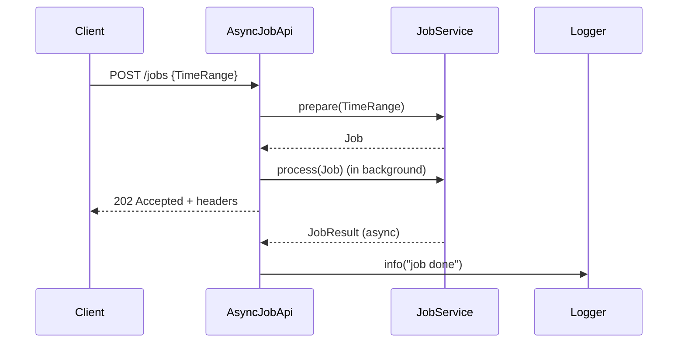

# AsyncJobApi: TDD Journey and Asynchronous REST Design

This article documents the iterative, test-driven development (TDD) process for building `AsyncJobApi` and its test suite, then evolving the endpoint from synchronous processing to parallel background processing.

## Table of Contents
- [Async REST Call: Sequence Diagram](#async-rest-call-sequence-diagram)
- [The Solution](#the-solution)
- [Background](#background)
- [Synchronous Job Processing](#synchronous-job-processing)
- [Asynchronous (Parallel) Job Processing](#asynchronous-parallel-job-processing)
- [Summary](#summary)

## Async REST Call: Sequence Diagram



## The Solution

### AsyncJobApiSpec (final intent)

```scala
"POST /jobs" should {
  "initiates the job in parallel and responds with HTTP headers immediately" in {
    for {
      jobResult  <- Deferred[IO, JobResult]
      deps       <- setup(jobResult)
      api         = AsyncJobApi(deps.jobService, deps.logger)
      response   <- api.routes.orNotFound.run(request).timeout(100.millis)
      assertion  <- checkResponse(response)
      _          <- verifyIO(deps.jobService)(_.prepare(is(query)))
      _          <- verifyIO(deps.jobService)(_.process(is(job)))
    } yield assertion
  }

  "log job result asynchronously when job completes" in {
    for {
      jobResult <- Deferred[IO, JobResult]
      deps      <- setup(jobResult)
      api        = AsyncJobApi(deps.jobService, deps.logger)
      response  <- api.routes.orNotFound.run(request).timeout(100.millis)
      assertion <- checkResponse(response)
      _         <- jobResult.complete(JobResult(jobId, processed = 40L))
      _         <- verifyIO(deps.logger):
                    _.info(is(s"[Async] [POST] [/jobs] id: $jobId, items processed: 40"))
    } yield assertion
  }
}
```

### AsyncJobApi (final intent)

```scala
class AsyncJobApi(jobService: JobService, logger: Logger) {
  val routes: HttpRoutes[IO] = HttpRoutes.of[IO]:
    case req @ POST -> Root / "jobs" =>
      req.as[TimeRange] >>= { query =>
        for
          job  <- jobService.prepare(query)
          _    <- jobService.process(job).flatMap(postProcess).start
          resp <- Accepted()
        yield
          resp
            .putHeader(Location(uri"/jobs" / job.id.toString))
            .putHeader(`X-Total-Count`(job.count))
      }

  private def postProcess(result: JobResult) =
    logger.info(s"[Async] [POST] [/jobs] id: ${result.id}, items processed: ${result.processed}")
}
```

## Background

Goal: implement an HTTP API for asynchronous job processing using Scala 3.8 syntax, Cats Effect, http4s, and Circe, with effectful tests (ScalaTest + Mockito).

Key assumptions/restrictions used during the TDD walkthrough:
- educational/demo scope
- mocked service dependencies
- no auth/rate limiting
- minimal error handling

## Synchronous Job Processing

The journey starts with a sequential implementation:
- red test for `202 Accepted`
- add `X-Total-Count` and `Location` headers
- introduce `JobService.prepare`
- parse `TimeRange` from request body
- add `process` call in sequence

This phase establishes correctness and type-safe header handling before introducing concurrency.

## Asynchronous (Parallel) Job Processing

Then tests are evolved to require immediate response while job processing continues in the background.

Key TDD evolution:
1. red test that hangs when completion is never signaled
2. add timeout to fail fast and restore red-green cycle
3. make green via `.start` on processing fiber
4. add async post-processing verification (`logger.info`) after `Deferred.complete`

This validates both fast HTTP response and eventual side effects after job completion.

## Summary

The TDD flow is:
- **Red**: express desired async behavior in tests
- **Green**: minimal implementation to satisfy behavior
- **Refactor**: remove duplication and improve effectful test ergonomics

The endpoint evolves safely from synchronous to asynchronous processing while preserving test coverage and design clarity.

---

Note: This article is now maintained as a dedicated topic file under `docs/articles/`.

