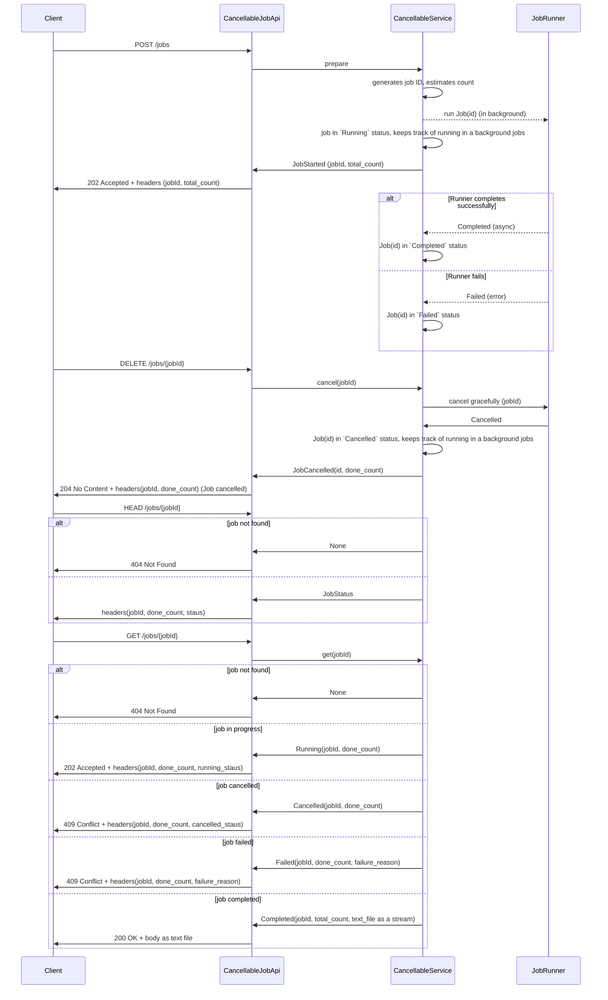

# CancellableJobApi

The `CancellableJobApi` is an interface that allows you to manage and cancel jobs in a system. It provides methods to cancel jobs, check the status of jobs, and retrieve information about jobs.

## Sequence Diagram

   

For the purpose of this article, we implement a `CancellableJobApi` that allows clients to start a job, cancel a job, and check the status of a job with `HEAD` request. 

The `CancellableService` is responsible for managing the jobs and their statuses, while the `JobRunner` is responsible for executing the jobs in the background. As far as a job is started it is in `Running` status.

When a client starts a job, the API prepares the job and estimates the total count of items to process. The job is then run in the background, and the client receives a response with the job ID and total count.

Assumptions:
- The job can always be started
- The job is a long-running process that can be cancelled gracefully.
