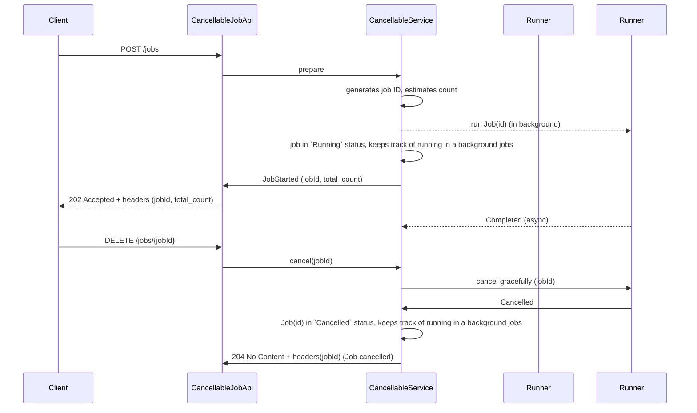

# CancellableJobApi

The `CancellableJobApi` is an interface that allows you to manage and cancel jobs in a system. It provides methods to cancel jobs, check the status of jobs, and retrieve information about jobs.

## Seq§uence Diagram

   

